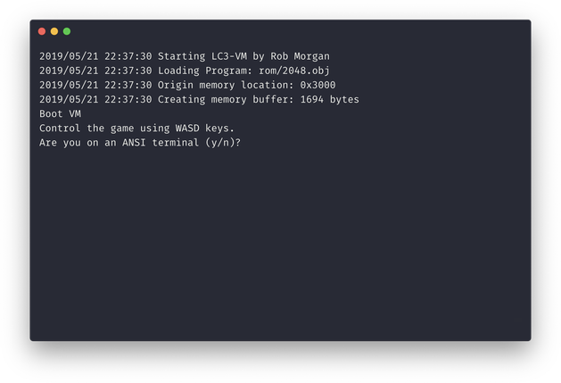

# LC-3 VM

This project is a really simple [LC-3](https://en.wikipedia.org/wiki/LC-3) VM written in Go. LC-3 or Little Computer 3 is
a fictional computer system that is designed to teach students how to code in assembly language. My VM is originally [based
on an article](https://justinmeiners.github.io/lc3-vm/) written by Justin Meiners and Ryan Pendleton.

## Current Status

- The VM is now able to run [2048](https://github.com/rpendleton/lc3-2048) by Ryan Pendleton.
- [Rogue](https://github.com/justinmeiners/lc3-rogue) doesn't get past the first screen.

## TODO

- [x] Fix Trap Routines for displaying output.
- [x] Fixed STI OpCode
- [x] Migrate to Termbox for key input
- [x] Add a flag for debug output
- [x] Add a flag to specify the target program
- [ ] Fix failing unit tests

## Development Resources

- https://wchargin.github.io/lc3web/

## LICENSE

MIT
